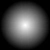

#ImageSound:
#Conversion of (Black/White) Images into Audio

ImageSound is a collection of command line tools for creating sound
files from image files, pixel by pixel.  ImageSound only considers
brightness, but ignores any color information (hue, saturation) in the
image input.  Support for colors is considered in successor projects.

Most of the code is written in Java.  The core synthesis has
additionally been implemented in C (via the JNI Java Native Interface)
to speed up conversion time.  Nowadays, with JIT compilers available
all around and garbage collector performance penalty being mitigated,
one probably would no more implement a JNI version of the synthesis.
Yet, the code shows the basics of synthesis in both languages, Java in
C.

This project has been abandoned in 1998 in favour of successor
projects.  It might pose a challenge to get the code running out of
the box on up-to-date systems without various updates in the sources.
Still, I put here the original sources as of July, 1998, mostly for
documentation purposes and as basis for other projects.  The source
also documents the origins of successor projects such as SoundPaint,
the SoundColumn or the ColorMovesSound project.

Examples
========
First experience with this toolkit resulted in two sound collages:
“Studie: Klangformen” and “1848/49”.

“Studie: Klangformen”
---------------------

“Studie: Klangformen” (“Study: Sound Shapes”) consists of a collection
of small images with various basic geometric shapes applied to the
ImageSound image to sound converter.  This collection of images was
used to get a first feeling for the capabilities and limitations of
ImageSound and were subsequently used to create the “1848/49” sound
collage.

* ###1. “Kreis” (“Circle”)
  
   
  [circle.mp3 (0'12'')](doc/examples/soundshapes/circle.mp3)

* ###2. “Ball” (“Ball”)
  
   
  [ball.mp3 (0'12'')](doc/examples/soundshapes/ball.mp3)

* ###3. “Inverser Ball” (“Reverse Ball”)
  
   
  [rev-ball.mp3 (0'12'')](doc/examples/soundshapes/rev-ball.mp3)

* ###4. “Bouboule” (“Bouboule”)
  
   
  [bouboule.mp3 (0'12'')](doc/examples/soundshapes/bouboule.mp3)

* ###5. “Helix 1” (“Helix 1”)
  
   
  [helix1.mp3 (0'12'')](doc/examples/soundshapes/helix1.mp3)

* ###6. “Helix 2” (“Helix 2”)
  
   
  [helix2.mp3 (0'12'')](doc/examples/soundshapes/helix2.mp3)

* ###7. “Dreieck” (“Ramp”)
  
   
  [ramp.mp3 (0'12'')](doc/examples/soundshapes/ramp.mp3)

“1848/49”
---------
“1848/49” is a sound collage that I created in 1998 on the occasion of
the 150th anniversary of the _Badische Revolution_, a historical event
of the years 1848/49.  Actually, this event was the motivation for
developing a small command line tool in Java for transforming
paintings into sound collages.  The capabilities of this tool are
somewhat limited.  It only supports grayscale images on the basis of a
purely sinoidal synthesis.  Moreover, the complexity of the
command-line parameters grew quickly such that the program became
difficult to control.  Therefore, in late 2003 I started a new try
called, based on the experience with ImageSound.  Still, I have here
the sound collage and the images that I originally fed into the old
program.  The images serve quite well as an aural score.

* ###1. “Verdruss” (“Displeasure”)
  
   
  [Verdruss.mp3 (0'25'')](doc/examples/1848-49/Verdruss.mp3)

* ###2. “Diskussion” (“Discussion”)
  
   
  [Diskussion.mp3 (0'27'')](doc/examples/1848-49/Diskussion.mp3)

* ###3. “Aufmarsch” (“Marching Up”)
  
   
  [Aufmarsch.mp3 (0'42'')](doc/examples/1848-49/Aufmarsch.mp3)

* ###4. “Kampf” (“Fight”)
  
   
  [Kampf.mp3 (0'37'')](doc/examples/1848-49/Kampf.mp3)

* ###5. “Niederlage” (“Defeat”)
  
   
  [Niederlage.mp3 (0'27'')](doc/examples/1848-49/Niederlage.mp3)

* ###6. “Flucht” (“Escape”)
  
   
  [Flucht.mp3 (0'27'')](doc/examples/1848-49/Flucht.mp3)

* ###7. “Reprise” (“Reprise”)
  
   
  [Reprise.mp3 (0'37'')](doc/examples/1848-49/Reprise.mp3)
